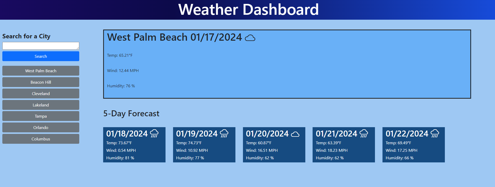

# Weather-Forecast

## Project description 

For this project, I utilized the openweathermap api to both look up a city and obtain the coordinates for it, and to then input those coordinates to obtain an accurate weather status for the current day and the five following days.

## Installation/Usage

To see the end result, simply visit [Weather-Forecast](https://kev-rod43.github.io/weather-forecast/). To utilize the app, search for the desired city on the left , or click on a previously searched city. The current weather plus the weather for the following 5 days will be displayed.
